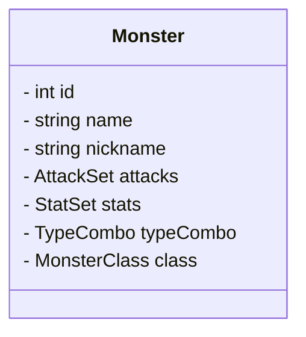

# Kämpfe
Kämpfe werden rundenbasiert gegen wildlebende Monster oder NPCs ausgeführt. Hierbei wird sich an Kämpfen aus anderen Spielen orientiert.
Gekämpft wird mit einem Team aus Monstern (Teamgröße zu ermitteln).
Ein Monster setzt sich aus verschiedenen Attributen zusammen.
## Monster-Attribute

### 1 - id
Die 'id' repräsentiert die Eintragsnummer in dem Monster-Verzeichnis.  
### 2 - names
Der 'name' ist die Bezeichnung der Monster-Art und 'nichkname' der Name den der Spielder vergeben kann.  
Die 'attacks' sind die Attacken die das Monster erlernt hat. Welche Attacken ein Monster erlernen kann wird festgelegt.
### 3 - details  

__3.1 - stats__  
Die 'stats' sind die Werte der Fertigkeiten. Es gibt folgende Werte:
| Wert             | Auswirkung                                    |
| ---------------- | --------------------------------------------- |
| Stärke           | Schaden von physischen Attacken               |
| Konstitution     | Widerstand gegen nicht-physische Attacken     |
| Verteidigung     | Widerstand gegen nicht-physische Attacken     |
| Geschicklichkeit | Schnelligkeit von Attacken und Ausweichen     |
| Intelligenz      | Schaden/Effektivität von psychischen Attacken |
| Wahrnehmung      | Treffsicherheit von Attacken                  |
| Glück            | Generelles Glück in Kämpfen                   |

__3.2 - Typen__ (werden noch erweitert)  
Die 'typeCombo' bestimmt die Typen. Sie haben Auswirkung auf Effektivität/Resistenzen/Widerstände von Attacken.
- Pflanze
- Feuer
- Wasser

__3.3 - Klasse__
Die Klasse eines Monsters wirkt sich auf die Attacken und einige Stats aus.  
Geplante Klassen:
- Schütze
- Krieger
- Stalker
- Magier
